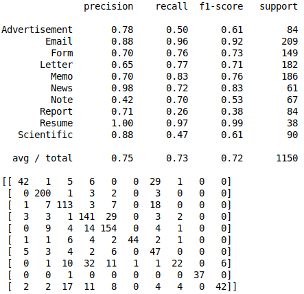

# Classification des documents du procès des groupes américains du tabac

Ben Hamadi Yamin

Nous avons une base de données de documents de différentes natures. Le but de ce notebook est d'essayer de classifier au mieux les documents en fonction de leurs catégories.

Nous avons 10 classes dont 3 voir 4 prédominantes sur 3482 fichiers. Essayons à présent de classifier ces fichiers.

# Naives Bayes Classifier

Commencons par effectuer une première classification avec le classifieur utilisé sur le base de donnée LeMonde.

Nous allons dans un premier temps utiliser la fréquence des mots dans les documents comme vecteur de caractéristiques. A l'aide de la méthode Vectorizer.

Nous pouvons voir qu'il y'a des classes beaucoup plus facile à classer que d'autres. Par exemple les emails ou les resume on de très bon recall et précision. Ceci peut s'expliquer par le fait que ces documents respectent un certain formalise, et il y'a par conséquents beaucoup de mots en communs dans ces documents. (Rappelons que nous avons utiliser Vectorizer c'est donc en fonction de la fréquence des mots que nous classifions). 
Tandis que d'autres documents comme les notes ou les reports sont plus difficile à classer car il n'y a pas de vocabulaire spécifique à ces documents.  
Il y'a des mots qui apparaissent beaucoup plus souvent que d'autres, c'est pourquoi nous allons maintenant voir si le fait de les éliminer peut nous aider à améliorer la classification.

# Stop Words

Sur cette base de données le fait de supprimer les stop words n'aide pas à une meilleur classification, voir même on perd quelques informations distriminatrices.

Essayons à présent une autre manière de représenter nos données.

# TF-IDF

Avec une représentation TF-IDF le classifieurs naives bayes à du mal à apposer le label sur les fichiers "Note" et "Report".
Ces fichiers peuvent être très différents de par leurs formes et leurs mots. Ce qui rend difficile sa classification en fonction d'un contexte.

Si le fait de changer la représentation n'améliore pas les perfomances, peut être changer de classifieurs pourrait les améliorer.

# Random Forest

Commencons par prendre une foret aléatoire avec 100 arbres et avec les hyperparamètres par défaut.

Resultat : 

Random Forest Score durant la phase de test : 0.68 (+/- 0.06) 
Random Forest Score durant la phase d'entrainement : 0.72 (+/- 0.05)

### Amélioration de la foret

##### Nombres d'arbres

Commencons par choisir plus judicieusement le nombre d'arbre. 
Voici une courbe qui représente la précision(y) en fonction du nombres d'arbres(x).

Nous allons utiliser une forêt de 800 arbres et un gridsearch pour les paramètres.

Nous d'obtenons de reel améliorations de performances, cependant il semble avoir une meilleurs homogénéité dans la classification. 
Il y'a encore beaucoup de réglage pouvant être effectué sur la foret aléatoire, mais après plusieurs test l'idée semble rester la même.

# Conclusion

C'est une base de données relativement difficile à classifier, notament à cause de certaines classes qui n'ont pas dévoilées leurs points communs à ces classifieurs. Peut être que d'autres classifieurs ou d'autres représentations peuvent être plus à même d'identifier les bonnes caractéristiques, Par exemple des classifieurs profonds. 
Il peut être aussi interessant d'associer des classifieurs d'images comme les CNN, avec des classifieurs de textes.
Cette base de données a des informations interessantes à tirer des images, comme le format. 
Enfin, avoir plus de données est toujours plus interessant en machine learning, des techniques de data augmentation pourrais améliorer la classification.
